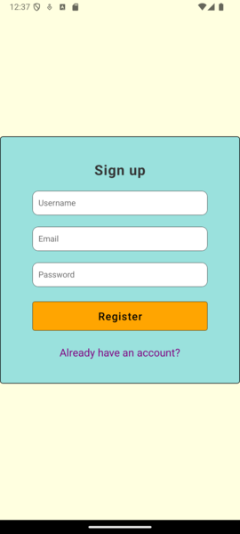

# Lamir News App

A React Native application that allows users to sign up and log in using Firebase Authentication, view the latest news via a REST API, and save or remove news articles using Firestore as the database.

## Features

- **User Authentication**: Sign up and log in with Firebase Auth.
- **View News**: Fetch and display news articles via a REST API.
- **Save Articles**: Save your favorite news articles to a personal collection.
- **Remove Articles**: Remove saved articles anytime.

---

## Screenshots

### 1. Sign Up Screen

### 2. Login Screen

### 3. Home Screen

### 4. Article Screen

### 5. Saved Articles Screen

---

## Tech Stack

- **React Native**: Front-end framework for building cross-platform mobile apps.
- **Firebase Auth**: User authentication (sign-up and login).
- **Firestore**: NoSQL database for storing user-saved news articles.
- **REST API**: Fetches the latest news articles.

---

